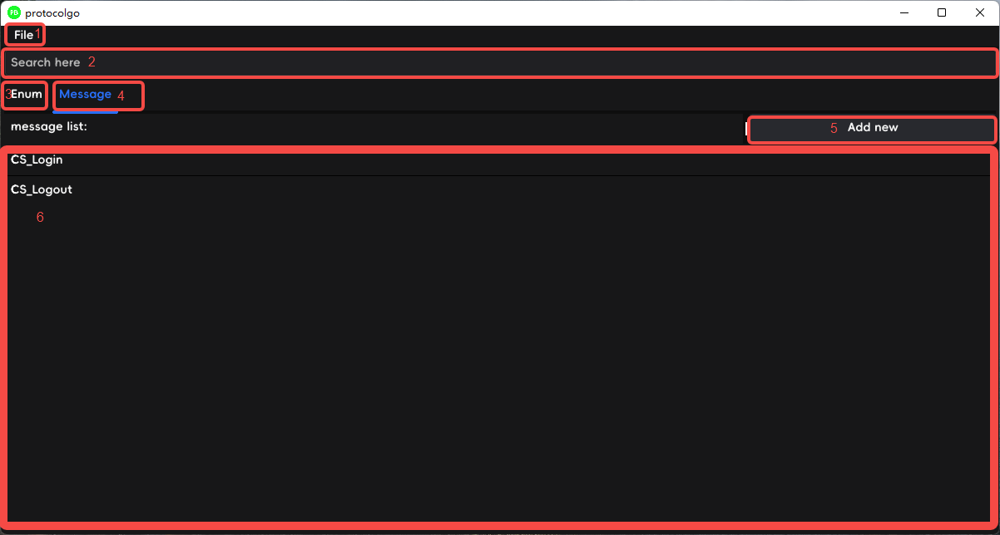
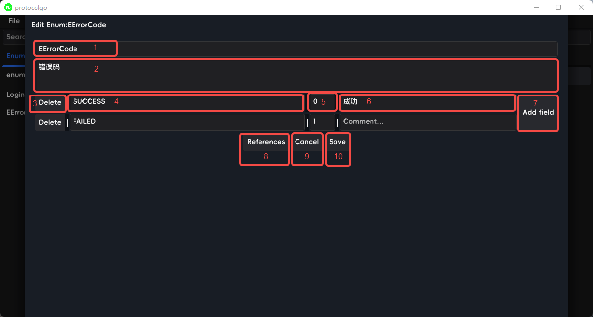
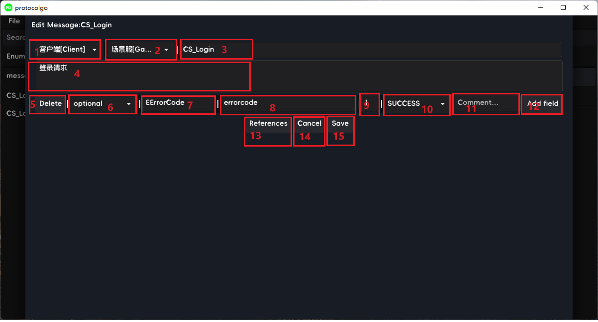

protocolgo
---------------------------------
### 1.简介
一个使用golang,基于fyne2.0的协议编辑工具.

问:为什么做这么一个工具?    
答: 1.直接编辑proto写协议会产生较大的不规范性.  
    2.根据proto自动生成协议注册代码具有局限性,需要辅以较多的潜规则标记或者注释.  
    3.对使用者更为简单和友好,相较于直接编辑proto,可以自动执行不具创造性的行为.  

### 2.功能简介
####2.1主界面

图中  
    1:菜单栏  
    2:模糊搜索框,可根据字段类型/字段名/注释等内容查找enum或者message.  
    3:enum标签页.  
    4:message标签页.  
    5:新增enum/message.  
    6:enum/message列表.双击可以进行编辑,右击可以选择编辑/删除.  
####2.2 Enum编辑页

图中  
    1:枚举名.  
    2:枚举注释.  
    3:行删除按钮.  
    4:枚举名.  
    5:枚举编号.  
    6:枚举行注释.  
    7:增加枚举.  
    8:显示使用此枚举的message.  
    9:取消编辑,不保存编辑内容.  
    10:保存编辑内容.  
####2.3 Message编辑页

图中  
    1:协议源地址下拉框,选项可在配置文件中配置.  
    2:协议目标地址下拉框,选项可在配置文件中配置.  
    3:协议名,协议名前缀与1和2下拉选项联动.  
    4:协议注释.  
    5:行删除按钮.  
    6:optional与repeated选项.  
    7:协议类型,与搜索框相同,可模糊搜索已有类型,如果是枚举类型,则会出现10(下拉复选框,内容为枚举值).  
      右键此框可编辑此类型,如果是枚举,在编辑框中新增枚举项,则会在10中同步出现.  
    8:字段名字.  
    9:字段索引值.  
    10:下拉框,只在字段类型为枚举类型时出现,选项内容为枚举类型的值.  
    11:字段注释.  
    12:新增字段按钮.  
    13:查看此message的被引用情况.  
    14:取消编辑.  
    15:保存编辑.  

### 3.TODO
~~1.xml向proto转化.  ~~
2.已有proto向xml转化.  ~~
~~3.展示新增项和修改项.  ~~
~~4.对所选项进行proto生成.  ~~
~~5.从proto生成pb代码.~~